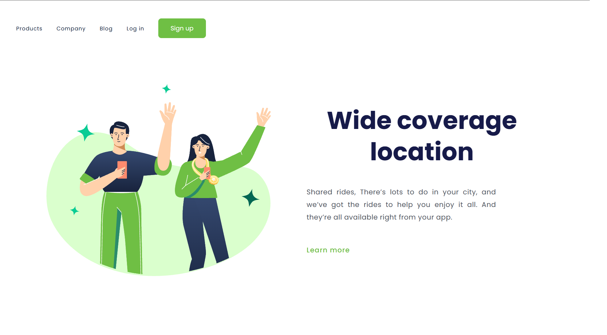

# Projeto - Pagina Wide coverage location

  
 
             
            
           
          
  

Projeto Wide coverage desenvolvido na formacãoo full stack da Devclub, no modulo de css, aprendendo as tag basicas e estilização e responsividade de paginas web

[Link da Pagina](https://willames-alves.github.io/projeto2-css/)

v